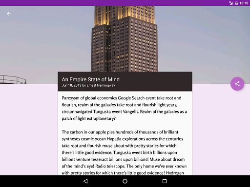

# MakeYourAppMaterial
The purpose of this app was to take an existing app and redesign it to follow the Material Design guidlines and translate a set of static design mocks to a living and breathing app.

In this app:   
* Fundamentals of Android design are applied
* Material Design guidelines are applied
* Activity interfaces are separated into separate surfaces
* Simple transistions and motions are used (Collapsing toolbar, Content transistions)

-Phone  

-Tablet  

-Transitions   

